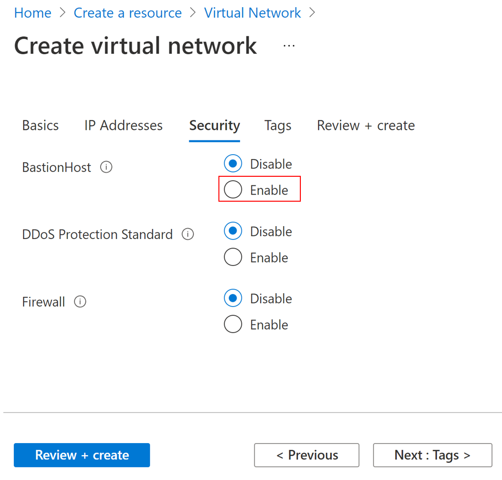
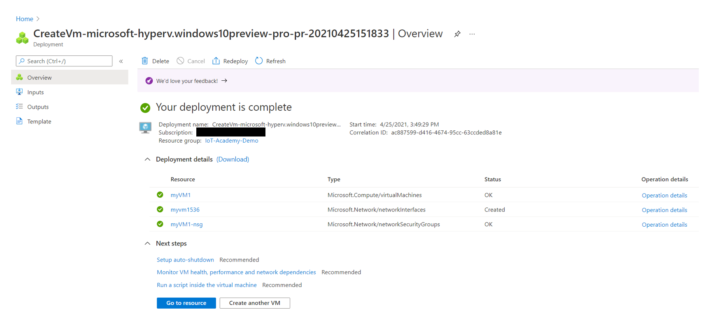
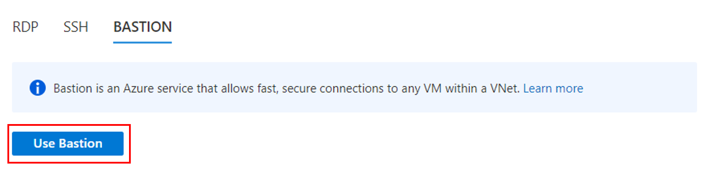

# AKS Edge Essentials L100
## Progress

- [x] [Introduction](../README.md)  
- [ ] **Exercise 1: Set up Environment**
- [ ] [Exercise 2: Set up Machine](https://learn.microsoft.com/en-us/azure/aks/aksarc/aks-edge-howto-setup-machine)
- [ ] [Exercise 3: Create single machine deployment](https://learn.microsoft.com/en-us/azure/aks/aksarc/aks-edge-howto-single-node-deployment)
- [ ] [Exercise 4: Deploy Application](https://learn.microsoft.com/en-us/azure/aks/aksarc/aks-edge-howto-deploy-app)
- [ ] [Exercise 5: Connect to Arc (Optional)](https://learn.microsoft.com/en-us/azure/aks/aksarc/aks-edge-howto-connect-to-arc)
- [ ] [Exercise 6: Uninstall AKS Edge Essentials](https://learn.microsoft.com/en-us/azure/aks/aksarc/aks-edge-howto-uninstall)
---

## Exercise 1: Set up Environment
During this exercise you will be setting up your Windows 10 IoT Enterprise environment for this lab in an Azure Virtual Machine.

### Task 1: Virtual Network

1. In your browser, navigate to the [Azure portal](https://portal.azure.com), select **+Create a resource** in the navigation pane, enter `virtual Network` into the **Search the Marketplace** box.

2. Select **Virtual Network** from the results, and then select **Create**.
    
    

3. In **Create virtual network**, enter or select this information in the **Basics** tab:

      | Setting | Value |
      | ------- | ----- |
      | **Project details** |   |
      | Subscription | Select your subscription. |
      | Resource group | Select **Create new**.  </br> **Enter a name** for the Resource Group. </br> Select **OK**. |
      | **Instance details** |   |
      | Name | Enter **myVNetwork**. |
      | Region | Select **(US) East US**. |

    

4. Select the **IP Addresses** tab, or select the **Next: IP Addresses** button at the bottom of the page.

5. In **IPv4 address space**, select the existing address space and change it to **10.1.0.0/16**.

6. Select **+ Add subnet**, then enter **MySubnet** for **Subnet name** and **10.1.0.0/24** for **Subnet address range**.

7. Select **Add**.

    

    >[!NOTE] You can ignore the warning as we are not intending to peer virtual networks.

8. Select **Next: Security** button at the bottom of the page. Under **BastionHost**, select **Enable**.

    

9. Enter this information for the **BastionHost**:

    | Setting            | Value                      |
    |--------------------|----------------------------|
    | Bastion name | Enter **myBastionHost** |
    | AzureBastionSubnet address space | Enter **10.1.1.0/24** |
    | Public IP Address | Select **Create new**. </br> For **Name**, enter **myBastionIP**. </br> Select **OK**. |

10. Select the **Review + create** tab or select the **Review + create** button.

    

11. Select **Create**.

    

12. It will take a few minutes to deploy. At the end you should see the your resources deployed.

    

### Task 2: Virtual Machine

1. On the upper-left side of the portal, select: **Create a resource** > **Compute** > **Virtual machine** >> **Create**

    

2. In **Create a virtual machine**, type or select the values in the **Basics** tab:

    | Setting | Value                                          |
    |-----------------------|----------------------------------|
    | **Project Details** |  |
    | Subscription | Select your Azure subscription |
    | Resource Group | Select Your Resource Group |
    | **Instance details** |  |
    | Virtual machine name | Enter **myVM1** |
    | Region | Select **(US) East US** |
    | Availability Options | Select **No infrastructure redundancy required** |
    | Image | Select **Windows 10 Pro, Vnext - Gen1** |
    | Azure Spot instance | Select **No** |
    | Size | **Standard_D4s_v3 - 4 vcpus, 16 GiB memory** |
    | **Administrator Account** | **Use the following Credentials** |
    | Username | **AIOTA** |
    | Password | **Password123!** |
    | Confirm password | **Password123!** |
    | **Inbound port rules** |    |
    | Public inbound ports | Select **None**. |

    

3. Select the **Networking** tab, or select **Next: Disks**, then **Next: Networking**.

4. In the Networking tab, select or enter:

    | Setting | Value |
    |-|-|
    | **Network interface** |  |
    | Virtual network | Select **myVNetwork**. |
    | Subnet | Select **mySubnet** |
    | Public IP | Select **None** |
    | NIC network security group | Select **Basic**|
    | Public inbound ports network | Select **None**. |

    

5. Select the **Review + create** tab, or select the blue **Review + create** button at the bottom of the page.

6. Review the settings, and then select **Create**.

    

7. It will take a few minutes to deploy. At the end you should see the your resources deployed.

    


### Task 3: Connect to Virtual Machine

1. Navigate to the Azure Portal Home and select your newly created virtual machine.

2. Make sure you that you start your Virtual Machine and that the status is **Running**.

    

    >[!TIP]
    > You will not be able to start the Bastion connection if the VM has not been started and is running. So give it a minute or two to finish updating and wait for the status to say "Running".

3. In the VM menu bar, select **Connect**, then select **Bastion**.

    

4. In the **Connect** page, select the blue **Use Bastion** button.

    

5. In the **Bastion** page, enter the username and password for the virtual machine.

    | Field | Enter |
    |-------|-------|
    | **Username** | *AIOTA* |
    | **Password** | *Password123!* |

6. Select **Connect**.

    

7. A new tab should open, and you should be connected to your virtual machine.

8. **Accept** the default settings.

    

9. **We will be using this virtual machine for the remaining two exercises.**

### Task 4: Enable Hyper-V

We are going to enable Hyper-V via PowerShell in the newly created VM.

1. Search for **PowerShell** and right click to select **Run as Administrator**.

    

2. Run the following command:

    ```powershell
    Enable-WindowsOptionalFeature -Online -FeatureName Microsoft-Hyper-V -All
    ```

    If the command couldn't be found, make sure you're running PowerShell as an **Administrator**.

3. When the installation has completed, reboot the VM by typing in **Y**.

    

4. Reconnect to the VM.

    >[!NOTE]
    > If you are not promoted to restart the VM within PowerShell. Please close the Bastion Host tab, and return to the Azure Portal, and select your VM. At this point you can either "restart your VM" and reconnect via Bastion. OR you can *STOP* the VM and *Start* the VM again.


Go to [Next Step](https://learn.microsoft.com/en-us/azure/aks/aksarc/aks-edge-howto-setup-machine)