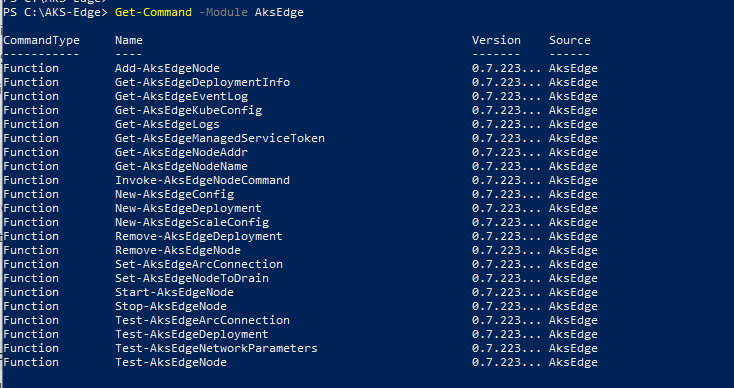

# AKS Edge Essentials L100
## Progress

- [x] [Introduction](../README.md)  
- [x] [Exercise 1: Set up Environment](./Documentation/SetUp_Environment.md)
- [ ] **Exercise 2: Set up Machine**
- [ ] [Exercise 3: Create single machine deployment](./Documentation/SingleMachine_Deployment.md)
- [ ] [Exercise 4: Deploy Application](./Documentation/Deploy_Application.md)
- [ ] [Exercise 5: Connect to Arc (Optional)](./Documentation/Connect_Arc.md)
- [ ] [Exercise 6: Uninstall AKS Edge Essentials](./Documentation/Uninstall.md)
---

## Exercise 2: Set up Machine

### Task 1: Prepare your machines for AKS Edge Essentials

#### Prerequisites

- Hardware requirements:

  | Specs | Requirement |
  | ---------- | --------- |
  | Memory | 4 GB at least 2 GB free (cluster-only), 8 GB (Arc and GitOps) |
  | CPU | Two logical processors, clock speed at least 1.8 GHz |
  | Disk space | At least 14 GB free |
  | Host OS | Windows 10/11 IoT Enterprise/Enterprise/Pro and Windows Server 2019, 2022 |

- OS requirements: 
    - Install Windows 10/11 IoT Enterprise/Enterprise/Pro on your machine and activate Windows. We recommend using the latest [version 21H2 (OS build 19044)](/windows/release-health/release-information). 
    - You can [download a version of Windows 10 here](https://www.microsoft.com/software-download/windows10) or [Windows 11 here](https://www.microsoft.com/software-download/windows11).

- Enable Hyper-V on your machine. You can check if Hyper-V is enabled using the following command:

    ```powershell
     Get-WindowsOptionalFeature -Online -FeatureName *hyper*
    ```

    You can enable Hyper-V on [Windows 10](/en-us/virtualization/hyper-v-on-windows/quick-start/enable-hyper-v) and on [Windows Server](/windows-server/virtualization/hyper-v/get-started/get-started-with-hyper-v-on-windows) as described.
- If your machine has **power standby** settings turned on, you'll have to turn it off using Command Prompt commands:

    ```bash
    powercfg /x -standby-timeout-ac 0
    powercfg /x -standby-timeout-dc 0
    ```

### Task 2: Download and install AKS Edge Essentials

You can deploy an AKS Edge Essentials cluster on either a single machine or on multiple machines. In this Lab we will deploy as single machine cluster. 

1. On your machine, download the **AksEdge-k3s MSI** or **AksEdge-k8s MSI** files, depending on which Kubernetes distribution you want to use. Also, if you're creating a Windows worker node, you will need the Windows node files.

    | File | Link |
    | ---- | ---- |
    | k8s installer | [aka.ms/aks-edge/k8s-msi](https://aka.ms/aks-edge/k8s-msi)  |
    | k3s installer | [aka.ms/aks-edge/k3s-msi](https://aka.ms/aks-edge/k3s-msi) |
    | Windows node files | [aka.ms/aks-edge/windows-node-zip](https://aka.ms/aks-edge/windows-node-zip) |

1. In addition to the MSI, Microsoft provides a few samples and tools which you can download from the [AKS Edge Utils GitHub repo](https://github.com/Azure/AKS-Edge). Navigate to the **Code** tab and click the **Download Zip** button to download the repository as a **.zip** file. Extract the GitHub **.zip** file to a working folder.

1. Before you install, make sure you uninstall any private preview installations and reboot your system before proceeding.

    Both k8s and k3s are supported. We have provided two separate MSI installers for each Kubernetes distribution. Do not install both k8s and k3s at the same time. If you want to install a different Kubernetes distribution, uninstall the existing one first and reboot.

    #### Option 1: Set up your machine as a Linux node

    Double-click the **AksEdge-k8s-x.xx.x.msi** or **AksEdge-k3s-x.xx.x.msi** file to install the latest version.

    #### Option 2: Set up your machine as a Linux and Windows node

    In order to configure your MSI installer to include Windows nodes, make sure you have the MSI installer with Kubernetes distribution of choice and the provided **AksEdgeWindows-v1** files in the same folder.

    1. Open PowerShell as an admin, and navigate to the folder directory with the installer and **AksEdgeWindows-v1** files.

    2. In the following command, replace `kXs` with the Kubernetes distribution you have installed and run:

        ```powershell
        msiexec.exe /i AksEdge-kXs-x.xx.x.msi ADDLOCAL=CoreFeature,WindowsNodeFeature
        ```

    3. Now you are ready to do mixed deployment.

### Task 3: Load and check AKS Edge modules

AKS edge modules can we loaded by running the `AksEdgePrompt` file from the `tools` folder in the downloaded [Github repo](https://github.com/Azure/AKS-Edge/blob/main/tools/AksEdgePrompt.cmd).

Once installation is complete, make sure it was successful by running the following command:

```powershell
Get-Command -Module AksEdge
```


You should see the following output with version:

```powershell
(Get-Module AksEdge -ListAvailable).Version
```

Go to [Next Step](./SingleMachine_Deployment.md)


