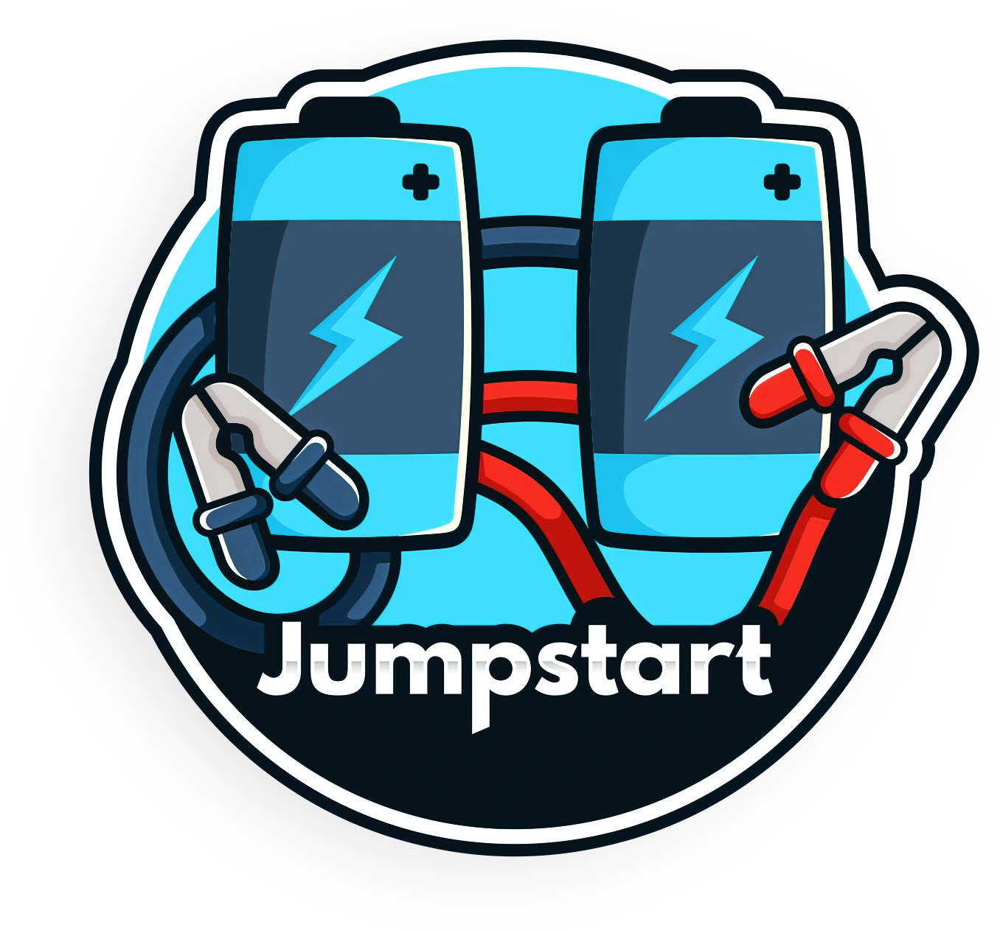

# AKS Edge Essentials Resources

This page provides a resource guide for new users to learn and start working with AKS Edge Essentials. Through demos, hands-on labs, and other collateral that come from a variety of sources, users can gain a comprehensive end-to-end understanding of AKS Edge Essentials. 

 1. [Azure Arc Jumpstart](https://azurearcjumpstart.io/)
  enables users to bring Azure security and cloud-native services to hybrid, multicloud, and edge environments. Through the Jumpstart overview, develop a high-level understanding of Azure Arc and its scenarios.  

  

. [Delete] For an introduction of AKS Edge Essentials and a demo of installation, deployment, connection to ARC, and other tools/services from a previous version of AKS Edge Essentials, watch the video below. 
    - embedded video?
    - Akri video?

2. Go through [hands on lab](./Documentation/SetUp_Environment.md) for a comprehensive Overview of AKS Edge Essentials and its requirements, as well as a quickstart guide for using the bits.

3. Try out AKS Edge Essentials yourself on an Azure VM – through these [hands-on instructions](https://github.com/mitkox/AKS-Edge/tree/main/hands-on), you can go through installing, connecting to Arc, and interoperability.

5. Watch the Arc Jumpstart AKS Edge Essentials video series for deep dives and demos.
    1. Supermarket demo with Arc and GitOps
        - Embedded video? 

         

    2. AKS Edge Essentials network architecture

         

6. Explore and try out end to end scenarios, such as this Welding Defect Detection sample. See other first and third party samples from EFLOW that can be adjusted and used for AKS Edge Essentials [here](https://github.com/Azure/iotedge-eflow/tree/main/samples). 

7. FAQ 

        -  For answers to commonly asked questions, refer to this page. 